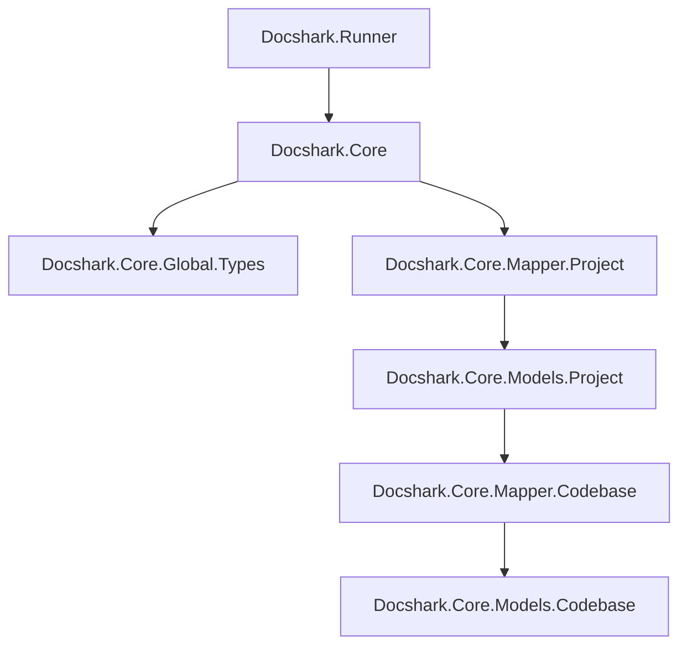

# Docshark.Core 
This library is the supporting library for Docshark which provides .NET developers with a means to generate documentation seamlessly from their codebase.

## Project Structure

- `Docshark.Runner` | Executeable entry point called by Node.js project to use this project
- `Docshark.Core` | Main library to be used directly by others
- `Docshark.Core.Mapper.Project` | Main hub for configuring *.csproj* files & building them
- `Docshark.Core.Models.Project` | Contains models that represent *.csproj* files and provides functionalities to interact with them *(in memory & on disk)*
- `Docshark.Core.Mapper.Codebase` | Main hub for codebase representation and organizes the codebase models into a tree like data structure
- `Docshark.Core.Models.Codebase` |  Contains models that represent the codebase's individual entities
- `Docshark.Core.Global.Types` | Manages a global dictionary that contains all types from every project and provides lookup functionalities

#### Types

- `Class`
  - IsPublic
  - IsPrivate
  - IsInternal
  - IsProtected
  - IsAbstract
  - IsSealed
  - IsStatic
  - Parent
- `Struct`
  - IsPublic
  - IsPrivate
  - IsInternal
  - IsProtected
  - Parent
- `Interface`
  - IsPublic
  - IsPrivate
  - IsInternal
  - IsProtected
- `Delegate`
  - IsPublic
  - IsPrivate
  - IsInternal
  - IsProtected
  - Parent

#### Members

- `Event`
  - IsPublic
  - IsStatic
  - IsProtected
  - IsInternal
  - IsAbstract
  - IsVirtual
- `Field`
  - IsPublic
  - IsReadonly
  - IsConstant
  - IsStatic
  - IsProtected
  - IsInternal
- `Property`
  - HasGetter
  - HasSetter
  - IsGetPublic
  - IsSetPublic
  - IsGetProtected
  - IsSetProtected
  - IsGetInternal
  - IsSetInternal
  - IsAbstract
  - IsVirtual
  - IsStatic
  - IsPublic
  - IsProtected
  - IsInternal
- `Method`
  - IsPublic
  - IsAbstract
  - IsVirtual
  - IsStatic
  - ReturnType
  - Parameters
  - IsInternal
  - IsProtected