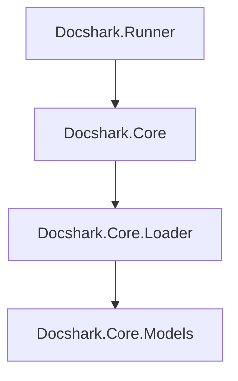

  

# DotDocs.Core *(.Docs.Core)* 
This is a supporting library for the [.Docs](https://github.com/Chase-William/.Docs) project. `DocDocs.Core` builds a *.csproj* and it's dependencies and extracts, organizes and exports types, assemblies, and project metadata to `JSON` files.

## Project Structure

- `DotDocs.Core.Runner`, Executeable entry point called by `.Docs` a *Node.js* project
- `DotDocs.Core`, Main library that contains high level commands for using dependencies
- `DotDocs.Core.Loader`, Contains logic for preparing, building, analyizing projects *(.csproj files)* 
- `DotDocs.Core.Models`, Contains models for projects, assemblies, types, and members etc.